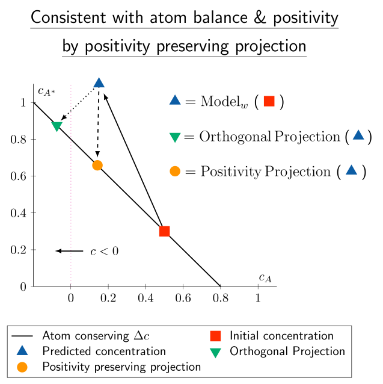

# Positivity preserving projection for mechanistic kinetics

[](http://creativecommons.org/licenses/by/4.0/)

This repository provides an implementation of the **Positivity Preserving Projection** to ensure physical consistency of surrogate models for mechanistic kinetics, as presented in:

**Kircher, T. & Votsmeier, M.**  
*"Machine Learning Surrogate Models for Mechanistic Kinetics: Embedding Atom Balance and Positivity"*  
_The Journal of Physical Chemistry Letters 0, 16 (2025)_
[DOI: 10.1021/acs.jpclett.5c00602](https://doi.org/10.1021/acs.jpclett.5c00602)

## 📖 Overview

This package provides a **Python implementation** of the positivity preserving projection and linear interpolation backtracking implemented using Numpy and Scipy. To get started, look at a simple example of this projection in  [`tutorial.ipynb`](tutorial.ipynb).



### 📂 Required Data Files:

This repository contains code to apply the positivity preserving projection on a catalytic reactor dataset, an atmospheric chemistry dataset and a dataset with randomly generated concentrations. For the catalytic reactor dataset and the random concentration dataset all files are available in this repository. The atmospheric chemistry dataset is taken from _Sturm & Silva_ [DOI: 10.1021/acsestair.4c00220](https://pubs.acs.org/doi/10.1021/acsestair.4c00220) and must be downloaded under:  

[DOI: zenodo.org/records/13385987](https://zenodo.org/records/13385987), "experiments_11e5_1hour_5mins_falsecombinatoricratelaws.csv"  
Place the downloaded file into the `data/OzonePhotochemistry/` directory.  

### 🛠 Code Structure:
- **Running experiments** Evaluation of model predictions and projections for all three datasets is in [`main.py`](main.py).
- **Projections for correcting surrogate models** Positivity preserving projection, orthogonal projection and linear interpolation backtracking are found under [`PositivityPreservingProjection/projections.py`](PositivityPreservingProjection/projections.py)
- **Evaluation for catalytic reactor dataset** Data is found in [`data/CatalyticReactor/ngasT_inlet_outlet.npy`](data/CatalyticReactor/ngasT_inlet_outlet.npy) and data handling is provided by [`PositivityPreservingProjection/catalyticreactor_dataset.py`](PositivityPreservingProjection/catalyticreactor_dataset.py). The trained neural network surrogate weights are available under  [`models/CatalyticReactorModel.pt`](models/CatalyticReactorModel.pt) and the model class under [`PositivityPreservingProjection/models.py`](PositivityPreservingProjection/models.py).
- **Evaluation for ozone photochemistry dataset** Data handling is provided by [`PositivityPreservingProjection/ozonephotochemistry_dataset.py`](PositivityPreservingProjection/ozonephotochemistry_dataset.py). The trained neural network surrogate weights are available under [`models/OzonePhotochemistryModel.pt`](models/OzonePhotochemistryModel.pt) and the model class under [`PositivityPreservingProjection/models.py`](PositivityPreservingProjection/models.py).
- **Evaluation for random concentration dataset** Data handling is provided by [`PositivityPreservingProjection/randomconcentration_dataset.py`](PositivityPreservingProjection/randomconcentration_dataset.py).

## 📦 Installation

```bash
git clone https://github.com/VotsmeierGroup/PositivityPreservingProjection
cd PositivityPreservingProjection
pip install -r requirements.txt
```

## How to Cite

If you use the **Positivity Preserving Projection** in your research, please cite the following article:

```bibtex
@article{doi:10.1021/acs.jpclett.5c00602,
author = {Kircher, Tim and Votsmeier, Martin},
title = {Machine Learning Surrogate Models for Mechanistic Kinetics: Embedding Atom Balance and Positivity},
journal = {The Journal of Physical Chemistry Letters},
volume = {0},
number = {0},
pages = {4715-4723},
year = {2025},
doi = {10.1021/acs.jpclett.5c00602},
    note ={PMID: 40323851}

